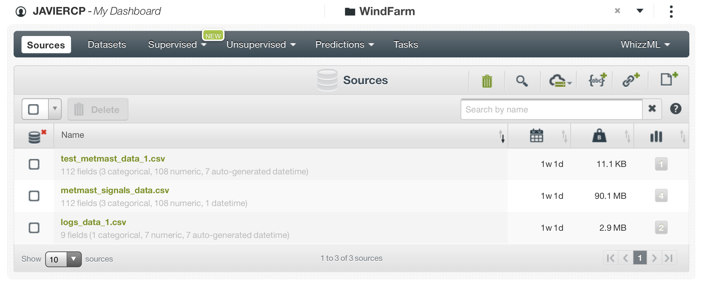
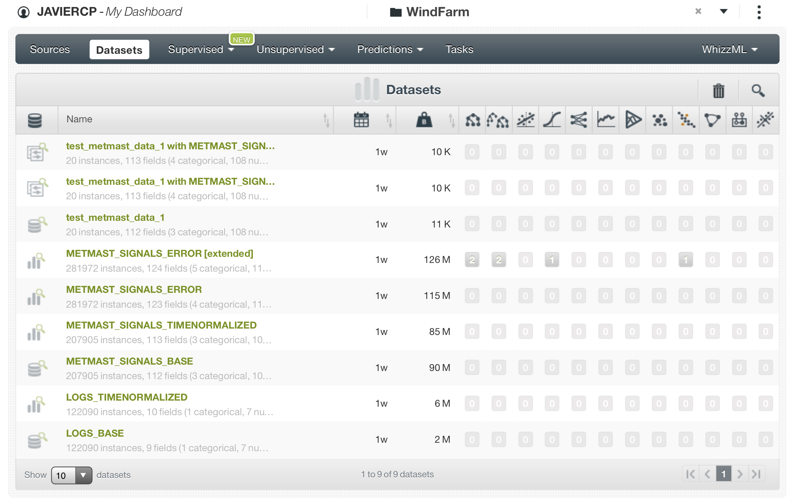
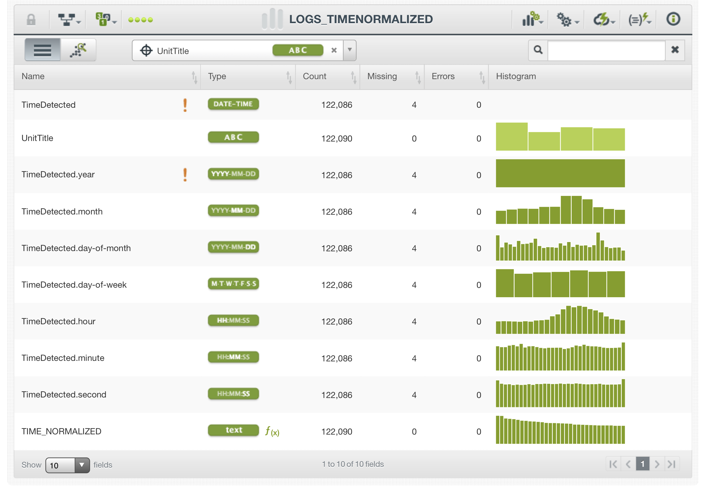
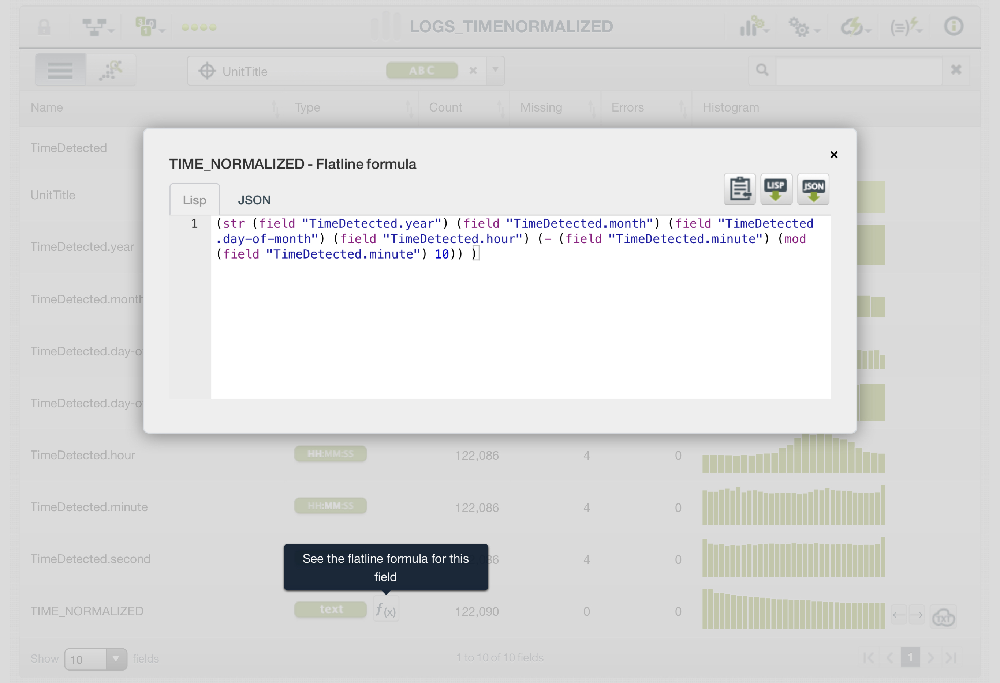
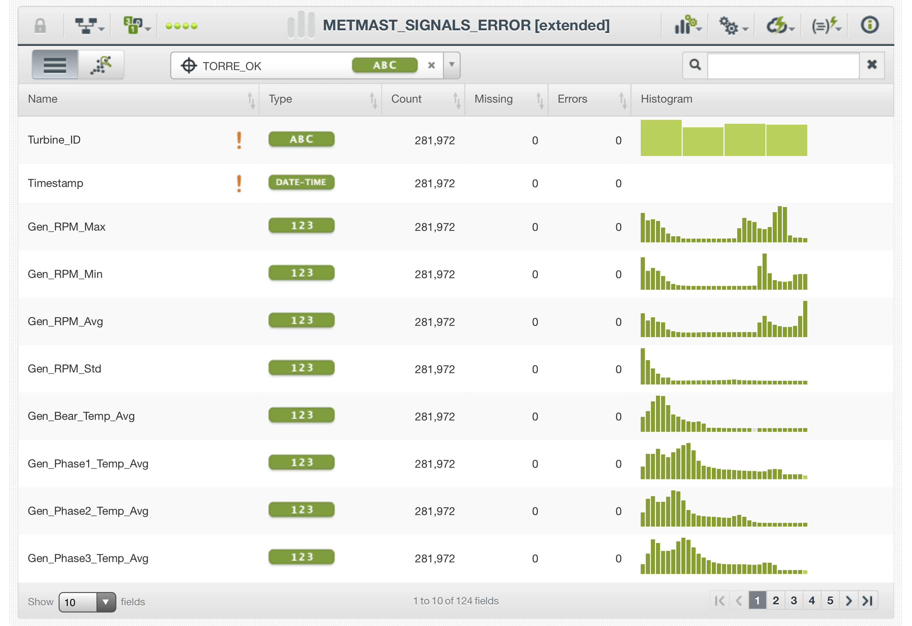
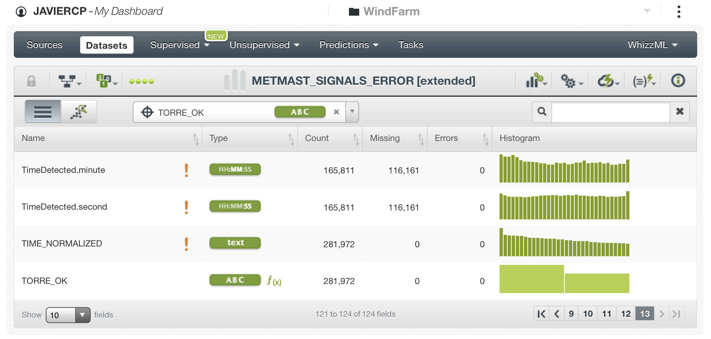
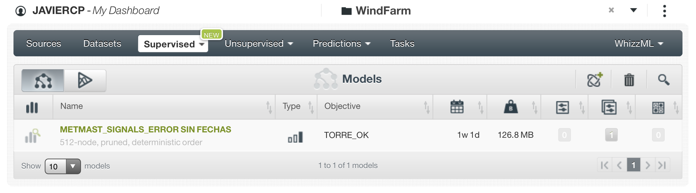
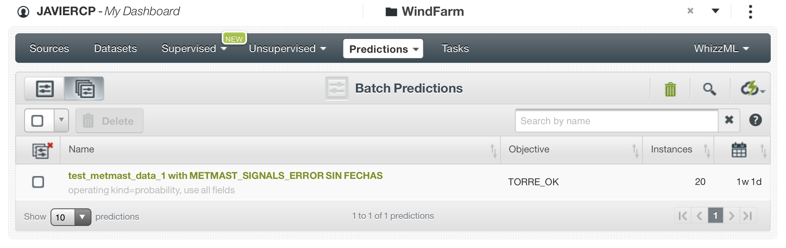
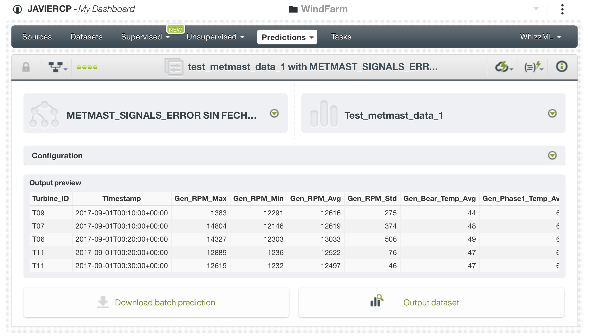

# Solución reto día del hackathon.

En este apartado está descrito cómo nuestro equipo solucionó este reto durante el Hackathon. Se han añadido comentarios para dar más claridad al desarrollo. Aparte de estas notas no hemos añadido nada sustancial al análisis que no fuese incluido durante la competición.  

Para ver un análisis hecho con más tiempo y más cercano a lo que nos hubiese gustado hacer puedes pasar directamente al apartado 3 de este notebook.

## Carga de las librerias necesarias.

```{r , warning= FALSE, message= FALSE}
library(tidyverse)
library(readxl)
library(VIM)
library(GGally)
library(lubridate)
library(stringr)
```

## Preparación datos "train".

Construimos tres listas con los archivos de training, cada una con un tipo de archivo: 'logs', 'metmast' y 'signals'. 
```{r , warning= FALSE, message= FALSE}
logs_files <- list.files(path = "data/Training", pattern = "wind-farm-1-logs*")
metmast_files <- list.files(path = "data/Training", pattern = "wind-farm-1-metmast*")
signals_files <- list.files(path = "data/Training", pattern = "wind-farm-1-signals*")
```

Utilizamos las tres listas creadas para importar todos los datasets de training y unirlos en tres: 'signals_data', 'metmast_data' y 'logs_data'.
```{r , warning= FALSE, message= FALSE}
signals_data <- signals_files %>%
    map(function(x) {
        read_xlsx(paste0("./data/Training/", x))
    }) %>%
    reduce(rbind)

metmast_data <- metmast_files %>%
    map(function(x) {
        read_xlsx(paste0("./data/Training/", x))
    }) %>%
    reduce(rbind)

logs_data <- logs_files %>%
    map(function(x) {
        read_xlsx(paste0("./data/Training/", x))
    }) %>%
    reduce(rbind)
```

Echamos un vistazo a la tabla logs_data obteniendo los principales estadísticos de cada variable.
```{r , warning= FALSE, message= FALSE}
summary(logs_data)
```

```{r , warning= FALSE, message= FALSE}
head(logs_data)
```

En principio de esta tabla solo vamos a necesitar la fecha y la identificacion de la turbina
```{r , warning= FALSE, message= FALSE}
logs_data_1 <- logs_data %>%
               select(TimeDetected,
                      UnitTitle) 
logs_data_1$TimeDetected <- ymd_hms(logs_data_1$TimeDetected)
logs_data_1$UnitTitle <- as.factor(logs_data_1$UnitTitle)
```

Solo hay logs en 4 unidades. Hay 4 NAs en las fechas
```{r , warning= FALSE, message= FALSE}
summary(logs_data_1)
```

Echamos un vistazo a la tabla metmast_data. Hay varios campos que parecen no tener informacion valida.
```{r , warning= FALSE, message= FALSE}
summary(metmast_data)
```
Nos quedamos solo con los campos que parecen tener informacion valida
```{r , warning= FALSE, message= FALSE}
metmast_data_1 <- metmast_data %>%
                  select(-Anemometer1_CorrOffset,
                         -Anemometer2_Freq, 
                         -Anemometer2_Offset, 
                         -Anemometer2_CorrGain,
                         -Anemometer2_CorrOffset,
                         -DistanceAirPress,
                         -AirRessureSensorZeroOffset,
                         -Min_Precipitation,
                         -Max_Precipitation,
                         -Avg_Precipitation,
                         -Min_Raindetection,
                         -Avg_Raindetection,
                         -Max_Raindetection,
                         -Min_Winddirection2,
                         -Max_Winddirection2,
                         -Avg_Winddirection2,
                         -Var_Winddirection2,
                         -Anemometer1_CorrGain,
                         )

metmast_data_1$Timestamp <- ymd_hms(metmast_data_1$Timestamp)
```

```{r , warning= FALSE, message= FALSE}
summary(metmast_data_1)
```

Echamos un vistazo a la tabla signals_data. Hay varios campos que parecen no tener informacion valida.
```{r , warning= FALSE, message= FALSE}
summary(signals_data)
```

```{r , warning= FALSE, message= FALSE}
signals_data$Timestamp <- ymd_hms(signals_data$Timestamp)
signals_data$Turbine_ID <- as.factor(signals_data$Turbine_ID)
```

```{r , warning= FALSE, message= FALSE}
summary(signals_data$Timestamp) 

```

```{r , warning= FALSE, message= FALSE}
summary(signals_data$Turbine_ID) 
```

Ahora tenemos que juntar las tres tablas. Las tablas metmast y signals no hay problema para el cruce. Lo hacemos por TimeStamp
```{r , warning= FALSE, message= FALSE}
metmast_signals_data <- signals_data %>%
                        left_join(metmast_data_1, by = 'Timestamp')
```

Exportamos los datasets a csv para su procesado en BIGml
```{r , warning= FALSE, message= FALSE}
write_csv(metmast_signals_data, "final_csvs/Training/metmast_signals_data.csv")
write_csv(logs_data_1, "final_csvs/Training/logs_data_1.csv")
```

## Preparación datos "test".

```{r , warning= FALSE, message= FALSE}
test_metmast <- read_xlsx(path = "./Data/Test/wind-farm-1-metmast-testing.xlsx")

test_metmast_data_1 <- test_metmast %>%
                  select(-Anemometer1_CorrOffset,
                         -Anemometer2_Freq, 
                         -Anemometer2_Offset, 
                         -Anemometer2_CorrGain,
                         -Anemometer2_CorrOffset,
                         -DistanceAirPress,
                         -AirRessureSensorZeroOffset,
                         -Min_Precipitation,
                         -Max_Precipitation,
                         -Avg_Precipitation,
                         -Min_Raindetection,
                         -Avg_Raindetection,
                         -Max_Raindetection,
                         -Min_Winddirection2,
                         -Max_Winddirection2,
                         -Avg_Winddirection2,
                         -Var_Winddirection2,
                         -Anemometer1_CorrGain,
                         )


test_signals <- read_xlsx(path = "./Data/Test/wind-farm-1-signals-testing.xlsx")

test_metmast_signals_data <- test_signals %>%
                        left_join(test_metmast_data_1, by = 'Timestamp')
```

```{r , warning= FALSE, message= FALSE}
write_csv(test_metmast_signals_data, "./final_csvs/Test/test_metmast_data_1.csv")
```

## Modelización en BigML

Aquí se ven las fuente de datos creadas para este reto. "logs_data_1.csv" es la fuente a partir de los errores de las torres. "metmast_signals_data.csv" es la fuente a partir de los datos de las condiciones meteorológicas y los datos de los sensores SCADA (procesadas en R para	hacer el join). Y "test_metmast_data_1.csv" es la fuente con los datos de test para hacer las predicciones.



Aquí se ven los datasets que creamos a partir de las dos fuentes. Como en el reto anterior se puede ver que creamos un dataset y sobre él fuimos iterando. Lo primero que hicimos fue normalizar la fecha de los errores que se podian producir en cualquier minuto mientras que las mediciones se realizaban cada 10 minutos. Luego hicimos un join de los datasets por el identificador de la torre y la fecha normalizada con lo que ya teniamos un dataset a partir del que entrenar el modelo.


Detalle del dataset de errores con el campo fecha normalizada.


Detalle de la función Lisp que utilizamos para normalizar los minutos de los logs.


Detalle del dataset final que utilizamos para entrenar el modelo con los campos que eliminamos para que no influyesen en la predicción.


Detalle del dataset final que utilizamos para entrenar el modelo con los campos que eliminamos para que no influyesen en la predicción.


Por tiempo solo nos dio tiempo a entrenar correctamente un arbol con el dataset.


Predicción batch para el modelo creada con el dataset de prueba.

Detalle de la predicción.


