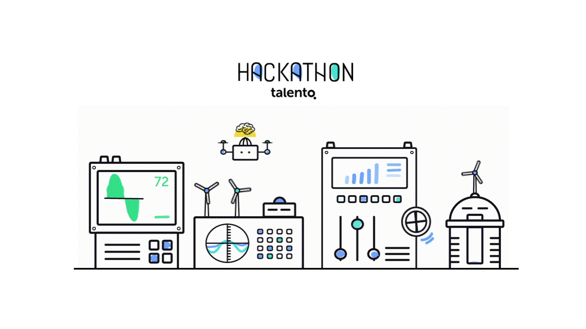

# Introducción {-}

Este notebook nace de nuestra participación el 4 de junio de 2019 como equipo en el [Hackathon de Machine Learning](https://hackathontalento.com/) organizado por [Talento Corporativo](https://www.talentocorporativo.com/) y patrocinado por [EDP](https://www.edpenergia.es/es/), [El Comercio](https://www.elcomercio.es/), [Clustertic](https://www.clustertic.net/) y [BigML](https://bigml.com/). 

La competición consistió en el planteamiento de un par de retos de Machine Learning basados en datos de EDP y en los que había que utilizar la herramienta BIGml para ejecutar los modelos. 

El contenido de este notebook corresponde a la realización del segundo reto, cuyo planteamiento se describe en el apartado uno. Durante la competición la mayor parte del tiempo la dedicamos a preparar los datasets de train y test, ya que tuvimos diversos problemas con el formato de los datos. Estas limitaciones de tiempo nos obligaron a saltarnos algunos pasos obligados en cualquier proceso de análisis de datos, como la exploración de los datos con visualizaciones o el estudio de la relación entre las distintas variables. Y esto tuvo como consecuencia que pásasemos por alto algún detalle muy importante. Todo esto está comentado con más detalle el apartado dos, donde describimos cómo solucionamos el reto durante la competición y en el apartado tres, donde ampliamos el análisis y mostramos un poco cómo nos gustaría haber resuelto el problema. 

Pese a todo esto tuvimos la suerte de poder pasar a la final y finalmente ganar la competición.

Todo el código y archivos necesarios para ejecutar este notebook está guardado en [este repositorio de Github](https://github.com/sergioberdiales/Hackathon_Talento_Reto_2_Wind_Farm).

Para cualquier consulta o sugerencia nos puedes contactar vía Linkedin:  
- [Linkedin - Sergio Berdiales]( https://www.linkedin.com/in/sergioberdiales/).  
- [Linkedin - Javier Campos](https://www.linkedin.com/in/francisco-javier-campos-peque%C3%B1o-66058348/).  
- [Linkedin - Manuel Antonio García](https://www.linkedin.com/in/manuel-antonio-g-13a01a7/).   

Un artículo en el periódico [El Comercio](https://www.elcomercio.es/) haciéndose eco del resultado de la competición: ["Calcular vatios tiene premio en el Hackathon"](https://www.elcomercio.es/tecnologia/calcular-vatios-premio-20190605000623-ntvo.html).
  
